# Laboratorio-2-señales-
>  Problema del coctel 
---

Septiembre 2024

## Tabla de contenidos
* [¿Qué se va a realizar?](#introduccion)
* [Problema del coctel](#problema)
* [Configuracion del sistema](#configuracion)
* [Librerias](#librerias)
* [Cargar audios de voces y rudios](#carga)
* [Graficas de onda del audio](#onda)
* [Espectro de frecuencia](#espectro)
* [Mezcla archivos de audio](#mezcla)
* [Uso de ICA, separacion y SNR relacion señal-ruido](#ica)
* [Calculo SNR voces separadas](#snr)
* [Menu](#menu)
* [Analisis](#analisis)
* [Contacto](#contacto)
---
<a name="introduccion"></a> 
## ¿Qué se va a realizar?

En un evento tipo coctel, se instalaron varios micrófonos para escuchar lo que las personas estaban hablando; una vez terminó la fiesta, se solicitó a los 
ingenieros que entregaran el audio de la voz de uno de los participantes. Los ingenieros analizaron las señales grabadas por los micrófonos eran mezclas 
de señales que provenían de diferentes fuentes (personas) para todos los casos y se encontraron con el problema de aislar la voz de interés. 

El problema de la "fiesta de cóctel" se refiere a la capacidad de un sistema para concentrarse en una sola fuente sonora mientras filtra las demás en un entorno con múltiples emisores de sonido. Este problema es común en sistemas de audición tanto humanos como artificiales, y su resolución es esencial en 
aplicaciones como la mejora de la voz, el reconocimiento de habla y la cancelación de ruido. 

Para este laboratorio, los estudiantes recrearán el problema de la fiesta de coctel, donde existen 𝑛 fuentes sonoras capturadas por un arreglo de 𝑛 
micrófonos de acuerdo con la siguiente metodología. 
1. Configuración del sistema: 
- Conecta los tres micrófonos al sistema de adquisición de datos y distribuyéndolos estratégicamente en la sala. Los micrófonos deben estar ubicados de manera que cada uno capture diferentes combinaciones de las señales provenientes de las tres fuentes.
- Ubicar tres personas en posiciones fijas dentro de la sala de laboratorio.
- Deben estar localizados a distancias diferentes y orientados en distintas direcciones para simular un entorno de "fiesta de cóctel". 
2. Captura de la señal:
- Generar la señal mediante la voz de los tres sujetos de prueba; cada uno debe decir una frase diferente durante el tiempo de captura de la señal. Las señales de los micrófonos deben ser registradas por el sistema de adquisición y guardas para ser analizadas.
- Grabar el ruido de la sala con los 3 micrófonos y calcular el SNR de cada señal. Repetir la medición en caso de que el SNR de alguna de las señales 
no sea suficiente. Argumentar las razones. 
3. Procesamiento de señales: 
- Realizar un análisis temporal y espectral de las señales capturadas por cada micrófono, identificando las características principales de cada fuente
sonora. Para realizar el análisis espectral, se recomienda utilizar la transformada de Fourier discreta (DFT) o la transformada rápida de Fourier (FFT),
describiendo la información que se puede obtener con cada una de ellas.
- Investigar los métodos de separación de fuentes, como el Análisis de Componentes Independientes (ICA), el Beamforming, entre otros, para aislar 
la señal de interés a partir de las señales capturadas por los micrófonos.  
4. Evaluar los resultados comparando la señal aislada con la señal original utilizado métricas de calidad como la relación señal/ruido para cuantificar el desempeño de la separación. 

<a name="problema"></a> 
## Problema del coctel

El efecto de fiesta de cóctel es un fenómeno que consiste en enfocar la atención auditiva en un estímulo acústico en particular, mientras se trata de filtrar y eliminar el resto de estímulos que pueden actuar como distractores.El nombre de este fenómeno es bastante representativo del efecto, dado que, si lo pensamos, en una fiesta, cuando estamos hablando con algún invitado, tratamos de filtrar lo que nos está diciendo e ignorando la música y otras conversaciones que puedan estar transcurriendo de forma simultánea, conformando el fondo.

Gracias a este fenómeno, somos capaces de diferenciar entre la voz de la persona con quien estamos manteniendo la conversación de la del resto de personas que puedan estar conformando el fondo acústico del ambiente en el que nos estamos encontrando.Este mismo fenómeno también es el que permite que, sin estar del todo concentrado en otras conversaciones, seamos capaces de captar la atención cuando se menciona una palabra que nos resulta importante, como puede ser el que nos llamen por nuestro nombre.

<a name="configuracion"></a> 
## Configuracion del sistema

En este caso como fue mencionado en la introduccion se debia realizar con 3 personas, en un inicio el laboratorio si se hizo de esa manera pero los audios tomados fueron de un tiempo muy bajo (1 segundo), por esta razon al no obtener un buen muestro decidio realizarse una nueva toma con 2 personas de  la siguiente manera:

Las personas se organizaron una en frente de la otra con una distancia de 27,9 cm equivalemte a lo que mide una hoja carta de largo desde los pies de la persona 1 al celular 1, luego otra hoja desde el celular 1 al celular 2 y una ultima hoja desde el celular 2 a la persona 2. 


La grabacion se realizo en este caso por medio una aplicacion llamada "Grabadora de Voz" la cual la podemos encontrar en app store, esto para asegurar que la frecuencia de muestreo que utilizaramos sea la misma.


Para la grabacion la frecuencia de muestreo fue de 16 kHz en cada celular, se grabaron 4 segundos del ruido del ambiente y 4 segundos a las personas hablando.

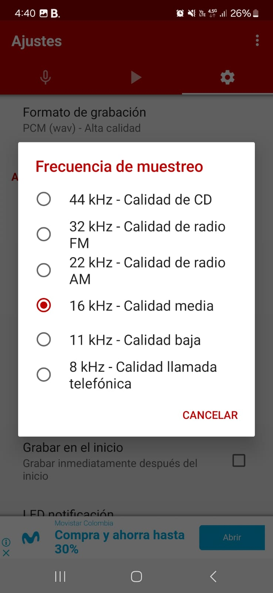

1. Audios persona 1  (Mariana):


https://github.com/user-attachments/assets/e087082f-2b14-4eb6-b42e-ab8e2317dc59

Dialogo: Mi nombre es Mariana Higuera, tengo 18 años y mi mamá se llama Lilian Caicedo.

https://github.com/user-attachments/assets/cd83c1c9-4014-4715-8696-32f6dae8d133

2. Audio persona 2 (Mamá):

https://github.com/user-attachments/assets/880810c3-7b88-43a7-87cd-1a991a7554f7

Dialogo: Mi mamá se llama Lilia Vasquez, yo tengo 51 años y mi nombre es Lilian Caicedo.

https://github.com/user-attachments/assets/ca4394b2-ae84-47e0-8e82-1a0b656d8360

<a name="librerias"></a> 
## Librerias
```c
import matplotlib.pyplot as plt
import numpy as np
import librosa
import sounddevice as sd
from sklearn.decomposition import FastICA
```
1. Librosa: Es una biblioteca especializada en el procesamiento de señales de audio. Es ampliamente utilizada para tareas como la extracción de características de audio, la generación de espectrogramas, y la manipulación de archivos de audio.

2. SoundDevice: Es una biblioteca que permite la grabación y reproducción de audio directamente desde Python usando dispositivos de audio.

3. FastICA (de sklearn.decomposition): Es una implementación del algoritmo de Análisis de Componentes Independientes (ICA) en la biblioteca scikit-learn. ICA es una técnica de separación de fuentes ciega (BSS) que intenta descomponer una señal multivariable en componentes estadísticamente independientes.

- Compatibilidad y Estandarización: .wav es un formato ampliamente compatible con diversas herramientas y bibliotecas de procesamiento de audio, incluidas librosa y sounddevice, que se utilizan en este código. Esto asegura que no haya problemas de compatibilidad al cargar o reproducir archivos de audio.

<a name="carga"></a> 
## Cargar audios de voces y ruidos

Este código está diseñado para trabajar con archivos de audio, específicamente para cargar y reproducir grabaciones de voces y ruidos almacenados en archivos de formato `.wav`. El código comienza definiendo dos listas, `audio_voces` y `audio_ruido`, que contienen los nombres de los archivos de audio correspondientes a las voces y ruidos que se desean manipular.

A continuación, se define una función llamada `loadAudio`, que utiliza la biblioteca `librosa` para cargar un archivo de audio. Esta función toma como parámetro el nombre o la ruta de un archivo de audio y devuelve dos cosas: un array NumPy que contiene los datos de la señal de audio y la tasa de muestreo con la que fue grabado el archivo. La tasa de muestreo es la cantidad de muestras por segundo que se toman del audio, y se mantiene intacta (sin cambios) al cargar el archivo.

La otra función, `playAudio`, se encarga de reproducir el audio que ha sido cargado. Esta función utiliza la biblioteca `sounddevice` para enviar los datos de audio al dispositivo de salida, como los altavoces o auriculares. La función recibe los datos de audio y la tasa de muestreo, los cuales son necesarios para que la reproducción sea precisa. Además, se incluye un comando para esperar hasta que la reproducción del audio haya terminado antes de proceder con cualquier otra operación en el código.

```c
# Archivos de voces y ruidos ya cargados
audio_voces = ["voz_mama.wav", "voz_mari.wav"]
audio_ruido = ["Ruidomama.wav", "ruidomari.wav"]

# Función para cargar un archivo de audio
def loadAudio(archivo):
    data, samplerate = librosa.load(archivo, sr=None)  # Carga el archivo de audio sin cambio de tasa de muestreo
    return data, samplerate

# Función para reproducir un audio
def playAudio(data, sr):
    sd.play(data, sr)  # Reproduce el audio
    sd.wait()  # Espera a que termine la reproducción
```

<a name="onda"></a> 
## Graficas de onda del audio

La función `graficarSonido` está diseñada para crear una visualización de la forma de onda de un archivo de audio. En primer lugar, la función calcula el tiempo en segundos para cada muestra de audio. Esto se realiza generando un array de índices que representan cada muestra en el archivo y dividiendo estos índices por la tasa de muestreo, `sr`. El resultado es un array que indica el tiempo correspondiente a cada muestra, permitiendo que el eje x del gráfico represente el tiempo en segundos.

Luego, la función crea una figura de tamaño 12x6 pulgadas para la visualización. Utiliza `matplotlib` para graficar los datos de audio, donde el eje x muestra el tiempo y el eje y muestra la amplitud de la señal. La línea del gráfico se dibuja en color azul con un grosor de 1.5 puntos. Para enfocar la visualización, el eje x se limita a los primeros 2 segundos del audio, lo que es útil si se desea examinar solo una parte específica de la señal.

```c
# Función para graficar la forma de onda del audio
def graficarSonido(data, sr, title=""):
    t = np.arange(len(data)) / sr  # Calcula el tiempo en segundos
    plt.figure(figsize=(12, 6))  # Tamaño de la figura
    plt.plot(t, data, color='royalblue', lw=1.5)  # Grafica la forma de onda en color azul
    plt.xlim(0, 2)  # Limita el eje x a los primeros 2 segundos
    plt.xlabel('Tiempo (s)')
    plt.ylabel('Amplitud')
    plt.title(title)
    plt.grid(True, linestyle='--', alpha=0.7)  # Añade una cuadrícula punteada
    plt.show()
```

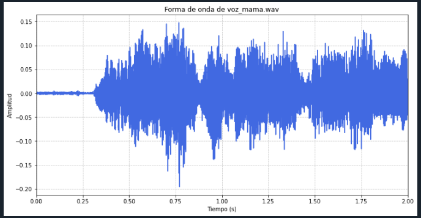

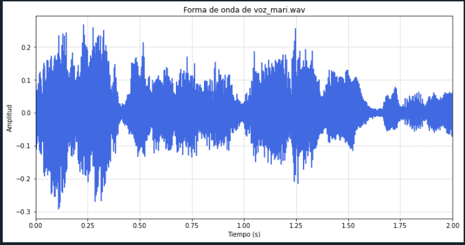

<a name="espectro"></a> 
## Espectro de frecuencia

La función `analisisEspectral` está diseñada para analizar y visualizar el espectro de frecuencias de una señal de audio. Primero, la función calcula el número total de muestras del audio mediante `n = len(data)`. También determina el intervalo de muestreo `T`, que es el inverso de la tasa de muestreo `sr`, indicando el tiempo entre cada muestra.

La función luego aplica la Transformada Rápida de Fourier (FFT) a los datos de audio con `np.fft.fft(data)`. La FFT convierte la señal del dominio del tiempo al dominio de la frecuencia, permitiendo analizar las frecuencias presentes en el audio. Para obtener las frecuencias correspondientes a la FFT, se usa `np.fft.fftfreq(n, T)`, y se toma solo la primera mitad de las frecuencias (`[:n // 2]`), ya que la FFT produce una imagen simétrica en el dominio de la frecuencia.

- Transformada rápida de Fourier FFT: Es un algoritmo utilizado para calcular la transformada discreta de Fourier (DFT) y su inversa de manera más eficiente. La DFT es una transformada utilizada en el procesamiento de señales y de imágenes, entre muchas otras áreas, para transformar una señal discreta en su representación en el dominio de la frecuencia. La FFT acelera el proceso de cálculo de la DFT, lo que permite su uso en aplicaciones en tiempo real y para grandes conjuntos de datos.

```c
# Función para analizar el espectro de frecuencias del audio
def analisisEspectral(data, sr, title="Espectro de frecuencias del audio"):
    n = len(data)  # Número de muestras
    T = 1 / sr  # Intervalo de muestreo
    yf = np.fft.fft(data)  # Transformada de Fourier del audio
    xf = np.fft.fftfreq(n, T)[:n // 2]  # Frecuencias correspondientes a la FFT
    
    plt.figure(figsize=(12, 6))  # Tamaño de la figura
    plt.plot(xf, 2.0 / n * np.abs(yf[:n // 2]), color='darkorange', lw=1.5)  # Grafica el espectro en color naranja
    plt.xlim(0, 2000)  # Limita el eje x a 2000 Hz
    plt.xlabel('Frecuencia (Hz)')
    plt.ylabel('Amplitud')
    plt.title(title)
    plt.grid(True, linestyle='--', alpha=0.7)  # Añade una cuadrícula punteada
    plt.show()
```

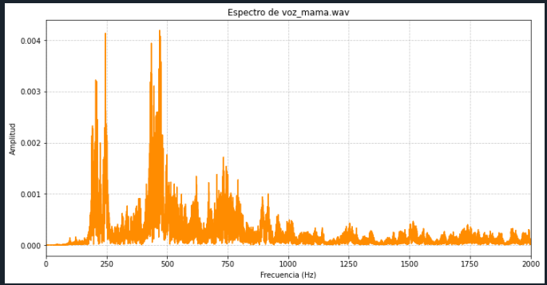

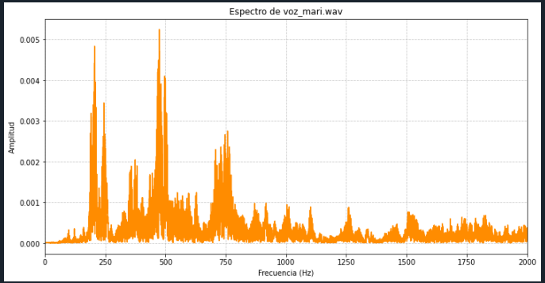

<a name="mezcla"></a> 
## Mezcla archivos de audio

La función `mezclarVoces` está diseñada para combinar dos archivos de audio en una sola señal, permitiendo mezclarlos para obtener una mezcla de las dos grabaciones. 

Primero, la función carga los datos de ambos archivos de audio utilizando la función `loadAudio`. Esto se realiza llamando a `loadAudio(audio1)` y `loadAudio(audio2)`, lo que devuelve dos conjuntos de datos de audio y la tasa de muestreo (`sr`). La tasa de muestreo es la misma para ambos archivos, ya que `loadAudio` se encargará de mantener la tasa original.

Luego, la función asegura que ambas señales de audio tengan la misma longitud para evitar problemas en el procesamiento posterior. Calcula la longitud mínima entre las dos señales usando `min(len(data1), len(data2))` y ajusta ambas señales a esta longitud. Esto garantiza que tanto `data1` como `data2` tengan el mismo número de muestras al recortar el exceso de datos en la señal más larga.

Las señales ajustadas se almacenan en una lista llamada `signals`. Luego, se utiliza `np.vstack(signals)` para apilar las dos señales en una matriz, donde cada fila representa una de las señales. Finalmente, la matriz se transpone con `mixed_signals.T` para que cada señal ocupe una columna en lugar de una fila.

El resultado de la función es una matriz en la que cada columna corresponde a una de las señales originales mezcladas, y se devuelve junto con la tasa de muestreo `sr`. Esta estructura facilita la manipulación y análisis de las señales mezcladas, permitiendo trabajar con ambas señales simultáneamente en el mismo formato.

```c
# Función para mezclar dos archivos de audio
def mezclarVoces(audio1, audio2):
    signals = []
    data1, sr = loadAudio(audio1)  # Carga el primer archivo
    data2, sr = loadAudio(audio2)  # Carga el segundo archivo
    
    # Ajusta la longitud para que ambas señales tengan el mismo tamaño
    min_len = min(len(data1), len(data2))
    data1 = data1[:min_len]
    data2 = data2[:min_len]
    
    signals.append(data1)
    signals.append(data2)
    
    # Apila las señales para mezclarlas
    mixed_signals = np.vstack(signals)
    return mixed_signals.T, sr  # Transpone la matriz para tener las señales en columnas
```
- Graficas mezcla y espectro mezcla mama:
- 
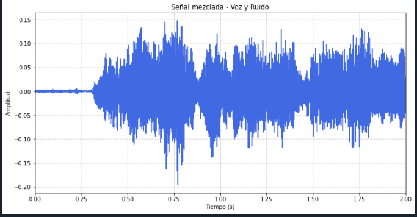

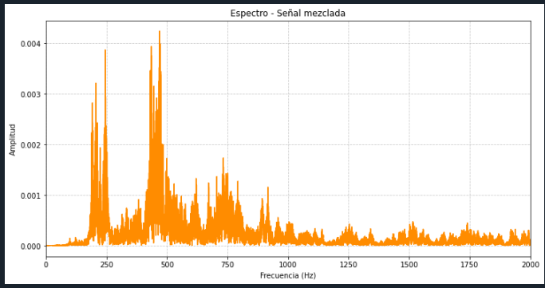

- Grficas mezcla y espectro mezcla mari:

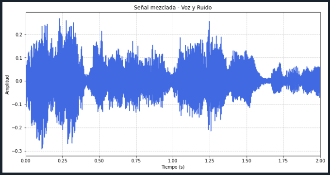

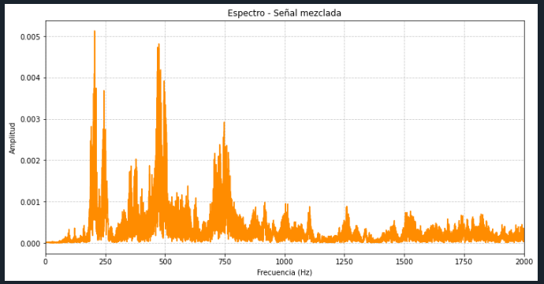

<a name="ica"></a> 
## Uso de ICA, separacion y SNR relacion señal-ruido

La función `aplicar_ica` está diseñada para aplicar el Análisis de Componentes Independientes (ICA) a una señal de audio con el objetivo de separar las señales mezcladas en componentes individuales. Primero, se configura el ICA mediante la creación de una instancia de `FastICA` con dos componentes (`n_components=2`), que indica que el algoritmo intentará separar la señal en dos componentes independientes. Además, se establecen parámetros como `max_iter=1000` para el número máximo de iteraciones y `tol=0.001` para la tolerancia de convergencia del algoritmo. Luego, se aplica ICA a la señal usando `ica.fit_transform(signal)`, que devuelve una matriz con las señales separadas. La función finalmente retorna esta matriz, donde cada columna representa una de las señales independientes obtenidas.

La función `potenciaDeSeñal` calcula la potencia de dos señales, una de voz y una de ruido. La potencia de una señal se define como el promedio de los cuadrados de sus valores. Para calcular la potencia de la voz, se utiliza `np.mean(voz**2)`, y para la potencia del ruido, se usa `np.mean(ruido**2)`. Estos cálculos permiten medir la intensidad de cada señal en términos de su energía promedio. La función retorna dos valores: la potencia de la voz y la potencia del ruido, facilitando la comparación entre ambos.

La función `identificar_voz` ayuda a determinar cuál de las componentes separadas por ICA corresponde a la señal de voz original. Primero, la función itera sobre las componentes obtenidas de ICA, graficando cada componente usando las funciones `graficarSonido` y `analisisEspectral` para mostrar la forma de onda y el espectro de frecuencias. Esto proporciona una visualización que ayuda al usuario a identificar cuál componente parece ser la voz. Después de mostrar las gráficas, el usuario debe seleccionar la componente que parece ser la voz a través de una entrada de texto. La función verifica si la selección es válida y devuelve la componente seleccionada. Si la selección no es válida, muestra un mensaje de error y retorna `None`. Este proceso permite identificar y extraer la señal de voz de las componentes separadas.

```c
# Función para aplicar ICA y separar las señales
def aplicar_ica(signal):
    ica = FastICA(n_components=2, max_iter=1000, tol=0.001)  # Configuración del ICA
    señales_separadas = ica.fit_transform(signal)  # Aplica ICA para separar las señales
    
    return señales_separadas

# Función para calcular la potencia de la señal
def potenciaDeSeñal(voz, ruido):
    potencia_voz = np.mean(voz**2)  # Calcula la potencia de la voz
    potencia_ruido = np.mean(ruido**2)  # Calcula la potencia del ruido
    return potencia_voz, potencia_ruido

# Función para identificar la componente de voz tras aplicar ICA
def identificar_voz(components, sr):
    # Asumimos que la componente más cercana a la forma de onda de la voz original es la voz
    for i, component in enumerate(components.T):
        graficarSonido(component, sr, f"Componente {i+1} para identificación de voz")
        analisisEspectral(component, sr, f"Espectro de la componente {i+1}")
    
    seleccion = int(input("\nSeleccione el número de la componente que parece ser la voz (1 o 2): ")) - 1
    if seleccion < 0 or seleccion >= len(components.T):
        print("Opción no válida.")
        return None
    return components[:, seleccion]  # Devuelve la componente seleccionada
```
El **Análisis de Componentes Independientes (ICA)** funciona a través de un proceso matemático que busca descomponer una señal mixta (como una mezcla de sonidos o señales de diferentes fuentes) en sus componentes originales, asumiendo que estos componentes son estadísticamente independientes entre sí.

### Pasos fundamentales del funcionamiento del ICA:

1. **Mezcla de señales**:
   Cuando diferentes señales independientes (por ejemplo, dos personas hablando al mismo tiempo) se capturan con un conjunto de sensores (micrófonos), estos capturan una mezcla lineal de todas las señales. Matemáticamente, la mezcla de señales se puede expresar como:
   
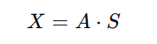

   Donde:
   - **X** representa las señales observadas (mezcladas) por los sensores.
   - **A** es una matriz de mezcla desconocida que representa cómo se combinan las señales independientes.
   - **S** son las señales originales independientes que queremos recuperar.

1. **Objetivo del ICA**:
   El objetivo del ICA es encontrar una matriz **W** que sea la inversa de la matriz de mezcla **A**, lo que permitirá obtener las señales originales separadas **S** a partir de las señales observadas **X**. Esto se logra mediante la ecuación:
   
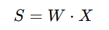
   
   Aquí, **W** es la matriz de pesos que ICA calcula para realizar la separación.

3. **Independencia estadística**:
   La clave del proceso es la suposición de que las señales originales **S** son **independientes estadísticamente** entre sí. Esto significa que los valores de una señal no influyen en los valores de las otras señales. Para encontrar **W**, el algoritmo ICA maximiza esta independencia.

4. **Maximización de la no-gaussianidad**:
   Una característica importante es que ICA maximiza la **no-gaussianidad** de las señales separadas. Esto se debe a que, según el **teorema del límite central**, una mezcla de muchas señales independientes tiende a tener una distribución cercana a la gaussiana (campana). Por lo tanto, para recuperar las señales originales, ICA busca aquellas señales que son lo más no-gaussianas posibles.

5. **Normalización y preprocesamiento (whitening)**:
   Antes de aplicar el algoritmo ICA, las señales suelen ser **normalizadas** o **blanqueadas** (whitening). Esto significa que las señales mezcladas se transforman para tener una **varianza unitaria** y **covarianza cero**, lo que facilita el cálculo de la matriz de mezcla **W**. Este paso asegura que las componentes tengan independencia, eliminando cualquier correlación lineal.

6. **Algoritmo iterativo**:
   El ICA se resuelve a menudo a través de algoritmos iterativos que ajustan gradualmente la matriz **W** hasta que se maximiza la independencia de las señales separadas. Algunos de los algoritmos populares utilizados para ICA son **FastICA** y **InfoMax**. Estos métodos ajustan los pesos con base en la información estadística de las señales mezcladas.
- Graficas voz separada y espectro voz separada mama:

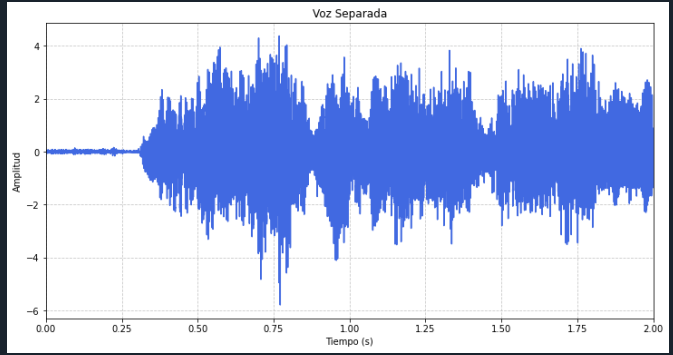

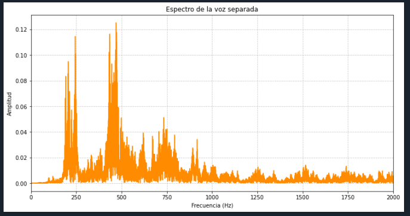

-SNR para la voz separada: 44.62 dB, es un valor bastante alto que indica una excelente calidad de la señal de audio. En términos simples, el SNR mide la relación entre la intensidad de la señal deseada (en este caso, la voz) y el nivel de ruido de fondo. Un SNR alto, sugiere que la señal de voz es mucho más fuerte que el ruido, lo que significa que el ruido tiene una presencia mínima en la señal final.

Este nivel de SNR implica que la voz separada es clara y bien distinguible, con poco impacto del ruido. Esto es crucial en aplicaciones de procesamiento de audio y comunicación, donde es importante mantener la claridad de la voz. En general, los valores de SNR más altos corresponden a una mejor calidad de la señal, con menos interferencia del ruido.

- Graficas voz separada y espectro voz separada mari:

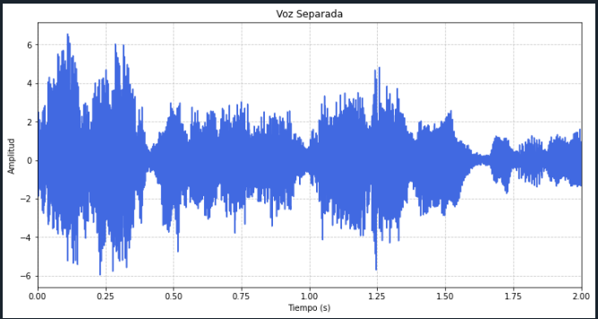

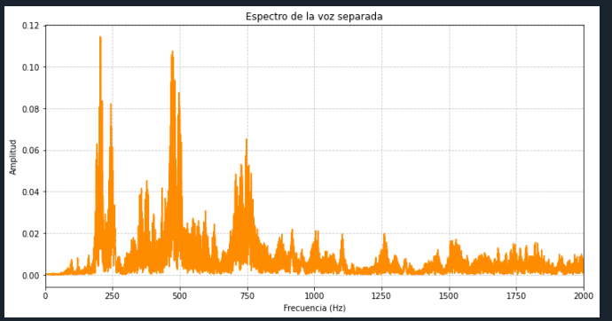

-SNR para la voz separada: 45.37 dB, es aún mejor que el valor anterior de 44.62 dB, y sigue indicando una calidad de señal excepcionalmente alta. Este valor sugiere que la señal de voz es extremadamente clara en comparación con el nivel de ruido de fondo.

Con un SNR de 45.37 dB, la voz separada es muy nítida, con el ruido presente en la señal siendo casi imperceptible. En términos prácticos, esto significa que la calidad de la señal de voz es excelente, y el ruido tiene un impacto insignificante, si es que se percibe en absoluto. Este alto SNR es indicativo de una separación de señales muy efectiva y de un procesamiento de audio de alta calidad.

<a name="snr"></a> 
## Calculo SNR voces separadas

La función `opcion_calcular_snr` tiene como objetivo calcular la relación señal-ruido (SNR) para cada par de archivos de audio de voz y ruido, y luego imprimir los resultados correspondientes. 

Primero, la función comienza con un bucle `for` que itera tres veces, una para cada par de archivos de audio especificado. El índice `i` se utiliza para acceder a los archivos en las listas `audio_voces` y `audio_ruido`, permitiendo procesar cada par de archivos en la iteración actual.

Dentro del bucle, la función carga los datos de audio para la voz y el ruido correspondientes al índice actual utilizando la función `loadAudio`. Esta función devuelve los datos de audio (`voz` y `ruido`) y la tasa de muestreo (`sr`). La tasa de muestreo se mantiene pero no se utiliza en cálculos posteriores dentro de esta función.

Luego, se calcula la potencia de cada señal utilizando la función `potenciaDeSeñal`, que toma como entrada los datos de `voz` y `ruido`. Esta función devuelve dos valores: `potencia_voz` y `potencia_ruido`, que representan la potencia de las señales de voz y ruido, respectivamente. La potencia se determina como el promedio del cuadrado de los valores de la señal.

Con las potencias calculadas, se procede a calcular el SNR en decibelios usando la fórmula:

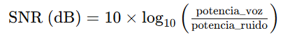


La función `np.log10` calcula el logaritmo en base 10, y el resultado se multiplica por 10 para expresar el SNR en decibelios.


```c
# Función para calcular la relación señal-ruido (SNR) para cada archivo
def opcion_calcular_snr():
    for i in range(3):
        voz, sr = loadAudio(audio_voces[i])
        ruido, sr = loadAudio(audio_ruido[i])
        potencia_voz, potencia_ruido = potenciaDeSeñal(voz, ruido)
        snr = 10.0 * np.log10(potencia_voz / potencia_ruido)  # Calcula el SNR en decibelios
        print(f"SNR para {audio_voces[i]}: {snr:.2f} dB")
```

SNR para voz_mama.wav: 15.20 dB
SNR para voz_mari.wav: 18.38 dB
### **Análisis del SNR**
1. SNR para voz_mama.wav: 15.20 dB

Un SNR de 15.20 dB indica que la señal de voz en el archivo voz_mama.wav es más fuerte que el ruido, pero el nivel de ruido es todavía notable en comparación con la señal. Este valor se encuentra en el rango donde la señal es audiblemente clara pero el ruido es perceptible. En aplicaciones prácticas, esto podría significar que la calidad del audio es aceptable pero podría haber una cierta interferencia o distracción causada por el ruido.

2. SNR para voz_mari.wav: 18.38 dB

Un SNR de 18.38 dB es superior al valor anterior y sugiere que la señal de voz en el archivo voz_mari.wav es aún más clara en comparación con el ruido. Aunque el ruido sigue presente, su impacto es menor en comparación con voz_mama.wav. Este valor de SNR indica una mejor calidad de la señal, con la voz siendo más prominente y menos afectada por el ruido de fondo. La calidad es bastante buena, y la interferencia del ruido es menos significativa.


Comparando ambos valores, voz_mari.wav tiene un SNR más alto (18.38 dB) que voz_mama.wav (15.20 dB), lo que implica que la señal de voz en voz_mari.wav es relativamente más clara y menos interferida por el ruido. Esto puede ser el resultado de una grabación de mejor calidad o una menor presencia de ruido en voz_mari.wav.

<a name="menu"></a> 
## Menu

### **Menú Interactivo**

La función `mostrar_menu` muestra un menú con opciones disponibles para el usuario. Cada opción corresponde a una funcionalidad específica relacionada con el procesamiento de archivos de audio, como cargar y reproducir un archivo, graficar y analizar el espectro de un archivo, mezclar voz y ruido, aplicar ICA para separar señales, calcular la relación señal-ruido (SNR), o salir del programa. El menú ofrece una forma clara de seleccionar la acción deseada.

### **Selección de Archivos de Audio**

La función `seleccionar_audio` permite al usuario elegir un archivo de audio de una lista. Imprime las opciones disponibles y solicita al usuario que seleccione un archivo mediante un número. Después de la selección, la función valida la opción elegida y devuelve el archivo seleccionado. Si la opción no es válida, la función muestra un mensaje de error y devuelve `None`. Esta función es útil para interactuar con listas de archivos y seleccionar el archivo que se desea procesar.

### **Carga y Reproducción de Audio**

La función `opcion_cargar_reproducir` utiliza `seleccionar_audio` para elegir un archivo de voz y luego carga y reproduce el archivo seleccionado. La carga se realiza mediante la función `loadAudio`, y la reproducción se lleva a cabo con la función `playAudio`. Esto permite al usuario escuchar el archivo de audio elegido.

### **Gráfica y Análisis Espectral**

La función `opcion_graficar_analizar` también utiliza `seleccionar_audio` para elegir un archivo de voz. Una vez seleccionado, la función carga el archivo y genera dos tipos de análisis: una gráfica de la forma de onda utilizando `graficarSonido` y un análisis espectral usando `analisisEspectral`. Esto proporciona una representación visual de la señal y su contenido en frecuencia.

### **Mezcla de Voz y Ruido**

La función `opcion_mezclar` permite al usuario seleccionar archivos de voz y ruido, y luego mezcla estas señales utilizando la función `mezclarVoces`. La señal mezclada se grafica y analiza espectralmente, y luego se reproduce. Este proceso muestra cómo la voz y el ruido se combinan en un solo archivo de audio.

### **Aplicación de ICA y Separación de Señales**

La función `opcion_aplicar_ica` utiliza ICA para separar las señales de voz y ruido. Primero, mezcla las señales seleccionadas, aplica ICA para separar las componentes y luego identifica cuál de las componentes es la voz usando `identificar_voz`. La voz separada se grafica y se analiza espectralmente, y se reproduce. Además, calcula el SNR de la voz separada en comparación con el ruido original, mostrando así la calidad de la separación.

### **Cálculo del SNR para Cada Archivo**

La función `opcion_calcular_snr` calcula el SNR para cada archivo de voz en la lista `audio_voces` en comparación con los archivos de ruido en `audio_ruido`. Para cada par de archivos, calcula la potencia de la voz y del ruido, y luego determina el SNR en decibelios. Este cálculo ayuda a evaluar la calidad de la señal de voz en comparación con el ruido.

### **Bucle Principal del Menú**

La función `main` contiene el bucle principal del programa, que muestra el menú y ejecuta la opción seleccionada por el usuario. El bucle continúa ejecutándose hasta que el usuario elige la opción de salir (`6`). Dependiendo de la opción seleccionada, llama a la función correspondiente (`opcion_cargar_reproducir`, `opcion_graficar_analizar`, etc.). Si el usuario ingresa una opción no válida, se muestra un mensaje de error. Al seleccionar salir, el bucle se rompe y el programa termina.

### **Ejecución del Programa**

Finalmente, el bloque `if __name__ == "__main__":` asegura que la función `main` se ejecute solo si el script se ejecuta directamente, y no cuando se importe como un módulo en otro script.

```c
# Menú interactivo para seleccionar opciones
def mostrar_menu():
    print("\nMenú de Opciones:")
    print("1. Cargar y reproducir un archivo de audio")
    print("2. Graficar y analizar espectralmente un archivo de audio")
    print("3. Mezclar voz y ruido")
    print("4. Aplicar ICA para separar señales")
    print("5. Calcular SNR (Relación Señal-Ruido)")
    print("6. Salir")

# Función para seleccionar un archivo de audio de una lista
def seleccionar_audio(lista_audios, tipo):
    print(f"\nSeleccione un {tipo}:")
    for i, archivo in enumerate(lista_audios):
        print(f"{i+1}. {archivo}")
    
    seleccion = int(input("Seleccione una opción (1-3): ")) - 1
    if seleccion < 0 or seleccion >= len(lista_audios):
        print("Opción no válida.")
        return None
    return lista_audios[seleccion]  # Devuelve el archivo seleccionado

# Función para cargar y reproducir un archivo de audio
def opcion_cargar_reproducir():
    archivo = seleccionar_audio(audio_voces, "archivo de voz")
    if archivo:
        data, sr = loadAudio(archivo)
        playAudio(data, sr)

# Función para graficar y analizar un archivo de audio
def opcion_graficar_analizar():
    archivo = seleccionar_audio(audio_voces, "archivo de voz")
    if archivo:
        data, sr = loadAudio(archivo)
        graficarSonido(data, sr, title=f"Forma de onda de {archivo}")
        analisisEspectral(data, sr, title=f"Espectro de {archivo}")

# Función para mezclar un archivo de voz y un archivo de ruido
def opcion_mezclar():
    voz = seleccionar_audio(audio_voces, "voz")
    ruido = seleccionar_audio(audio_ruido, "ruido")
    
    if voz and ruido:
        data_mezclada, sr_mezclada = mezclarVoces(voz, ruido)
        graficarSonido(data_mezclada[:, 0], sr_mezclada, "Señal mezclada - Voz y Ruido")
        analisisEspectral(data_mezclada[:, 0], sr_mezclada, "Espectro - Señal mezclada")
        playAudio(data_mezclada[:, 0], sr_mezclada)

# Función para aplicar ICA y separar la voz
def opcion_aplicar_ica():
    voz = seleccionar_audio(audio_voces, "voz")
    ruido = seleccionar_audio(audio_ruido, "ruido")
    
    if voz and ruido:
        data_mezclada, sr_mezclada = mezclarVoces(voz, ruido)
        señales_separadas = aplicar_ica(data_mezclada)
        
        # Identificar y reproducir solo la componente que parece ser la voz
        voz_separada = identificar_voz(señales_separadas, sr_mezclada)
        if voz_separada is not None:
            graficarSonido(voz_separada, sr_mezclada, "Voz Separada")
            analisisEspectral(voz_separada, sr_mezclada, "Espectro de la voz separada")
            print("Reproduciendo voz separada...")
            playAudio(voz_separada, sr_mezclada)
            
            # Cargar el ruido original para el cálculo del SNR
            ruido_original, sr_ruido = loadAudio(ruido)  # Cargar los datos de ruido
            
            # Ajustar el tamaño del ruido a la longitud de la voz separada
            min_len = min(len(voz_separada), len(ruido_original))
            voz_separada = voz_separada[:min_len]
            ruido_original = ruido_original[:min_len]
            
            # Calcular la potencia de la voz separada y el ruido
            potencia_voz_separada = np.var(voz_separada)  # Varianza como estimación de potencia
            potencia_ruido = np.mean(ruido_original**2)  # Potencia del ruido
            
            # Calcular el SNR
            snr = 10.0 * np.log10(potencia_voz_separada / potencia_ruido)
            print(f"SNR para la voz separada: {snr:.2f} dB")

# Función para calcular la relación señal-ruido (SNR) para cada archivo
def opcion_calcular_snr():
    for i in range(3):
        voz, sr = loadAudio(audio_voces[i])
        ruido, sr = loadAudio(audio_ruido[i])
        potencia_voz, potencia_ruido = potenciaDeSeñal(voz, ruido)
        snr = 10.0 * np.log10(potencia_voz / potencia_ruido)  # Calcula el SNR en decibelios
        print(f"SNR para {audio_voces[i]}: {snr:.2f} dB")

# Bucle principal del menú
def main():
    while True:
        mostrar_menu()  # Muestra el menú de opciones
        opcion = input("\nSeleccione una opción (1-6): ")
        
        # Ejecuta la opción seleccionada
        if opcion == "1":
            opcion_cargar_reproducir()
        elif opcion == "2":
            opcion_graficar_analizar()
        elif opcion == "3":
            opcion_mezclar()
        elif opcion == "4":
            opcion_aplicar_ica()
        elif opcion == "5":
            opcion_calcular_snr()
        elif opcion == "6":
            print("Saliendo...")
            break  # Sale del bucle y termina el programa
        else:
            print("Opción no válida, intente de nuevo.")

if __name__ == "__main__":
    main()  # Ejecuta la función principal


```

<a name="analisis"></a> 
## Analisis

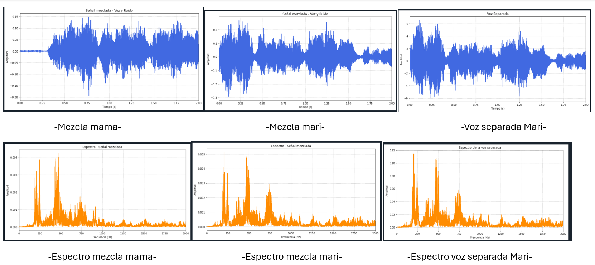

### Análisis de la imagen:

#### Parte superior (Ondas en el tiempo):
En la parte superior de la imagen, se visualizan tres señales de audio, representadas en el dominio del tiempo. Las dos primeras gráficas muestran las **señales mezcladas** ("Mezcla mama" y "Mezcla mari"), que son combinaciones de dos fuentes de audio (voces) con ruido adicional. Estas señales son más caóticas debido a la combinación de múltiples fuentes, lo que sugiere la interferencia entre las voces y el ruido. En la tercera gráfica, se muestra la **voz separada de Mari**, que tiene una forma de onda más limpia y regular. Esto indica que, tras aplicar un algoritmo de **Análisis de Componentes Independientes (ICA)** , se ha conseguido extraer la señal de la voz de Mari de manera efectiva, reduciendo el ruido y las interferencias de otras fuentes.

La principal idea del ICA es que las señales independientes pueden separarse mediante la maximización de su independencia estadística, lo cual parece haberse logrado en la gráfica de la señal separada de Mari. Se puede observar que las señal recuperada (Voz Mari) es bastante similar a las original. Sin embargo, es importante destacar que una limitación del método ICA es su incapacidad para determinar la varianza de las componentes independientes que forman parte de la mezcla, lo que provoca una diferencia en la amplitud original de las fuentes sonoras. Además, es relevante mencionar que cuando alguna de las señales mezcladas contiene pausas o silencios, durante la separación estos silencios pueden incluir sonidos de otras clases, aunque la señal principal sigue siendo claramente comprensible.


#### Parte inferior (Espectros de frecuencia):
En la parte inferior de la imagen, se presentan los **espectros de frecuencia** de las señales mostradas arriba. El espectro de frecuencia permite analizar cómo la energía de una señal está distribuida a través de diferentes frecuencias. Los primeros dos gráficos muestran los **espectros de las señales mezcladas** ("mezcla mama" y "mezcla mari"). Ambos espectros muestran picos en diferentes bandas de frecuencia, lo cual indica que las señales mezcladas contienen componentes tanto de las voces como del ruido. La mezcla de estas señales en el espectro de frecuencia puede complicar el proceso de separación, ya que no siempre es trivial distinguir entre los componentes de voz y los de ruido.

El tercer gráfico muestra el **espectro de la voz separada de Mari**. Aquí, los picos más altos en el espectro corresponden a las frecuencias características de la voz humana, y la presencia de ruido es notablemente menor en comparación con las mezclas originales. Esto sugiere que el método de separación ha logrado atenuar significativamente el ruido, permitiendo una extracción más pura de la señal de voz. Según el primer archivo, uno de los objetivos del análisis de señales y muestreo compresivo es recuperar señales de audio limpias en situaciones donde haya interferencias, lo que se refleja claramente en esta parte del análisis.

#### Relación con los valores de SNR:
La Relación Señal a Ruido (SNR) es una métrica clave para evaluar la calidad de la separación de señales. Los valores de SNR proporcionados indican lo bien que el algoritmo ha separado la señal deseada del ruido. Para las primeras dos señales separadas, los valores de SNR son **44.62 dB** y **45.37 dB**, lo que representa una separación de alta calidad con muy poco ruido residual. Estos valores son consistentes con lo que se espera en una separación de señales efectiva, como se menciona en el archivo sobre el uso del ICA para extraer señales de audio. El archivo también menciona cómo el rendimiento del sistema se puede evaluar mediante medidas como el SNR.

Sin embargo, el tercer valor de SNR para la señal "voz_mari.wav" es de **18.38 dB**, un valor considerablemente más bajo. Esto indica que, aunque la señal fue separada, aún existe un nivel más alto de ruido en la señal final en comparación con las otras dos. El primer archivo sugiere que las técnicas de procesamiento pueden verse limitadas por la complejidad de las señales mezcladas, lo cual podría explicar este valor más bajo de SNR.

<a name="contacto"></a> 
## Contacto
* Creado por [Marianitex](https://github.com/Marianitex) - sígueme en mis redes sociales como @_mariana.higuera


